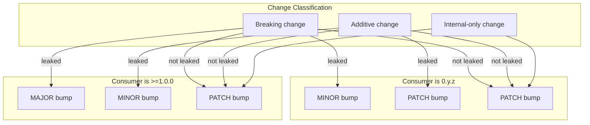

# semwave

`semwave` is a static analysis tool that answers the question:

> "If crates A, B and C have breaking/additive changes in this repo - what else do I need to bump and how?"

It will help you to push changes faster and not break other people's code.

## Motivation

Many people (including me) often violate semver rules due to the complexity
and indirection of dependencies. This causes a lot of troubles for the users and other contributors.
The tools that are supposed to fix the situation are often painfully slow (as you need to compile 
your entire workspace), rely on special commit format (i.e. conventional commits) and are not proactive - you need to make a mistake in order for them to "fix you" afterwards, instead of telling you right away how exactly should you set your versions.

`semwave` is here to change this.

## How it works?

It diffs `Cargo.toml` files between two git refs, identifies crates whose dependency
versions changed in breaking or additive ways (the "seeds"), and then walks the workspace
dependency graph to figure out which downstream crates re-export those types in their
public API. The required bump for each consumer depends on both the type of change
(breaking vs additive) and the consumer's version scheme (`0.y.z` vs `>=1.0.0`).

Under the hood it uses `cargo public-api` (nightly) to inspect each crate's
public surface, matches type paths against bumped dependency names, and propagates
results through the full resolve graph.

The result is three lists: MAJOR bumps, MINOR bumps, and PATCH bumps, plus optional
warnings when it had to guess conservatively.



## The good

- **Pro-active.** Tells you which crates in the workspace need what bumping (major/minor/patch)
if crates A, B, C, etc. got breaking or additive changes. Handles both `0.y.z` and `>=1.0.0` version schemes correctly.
- **10+ times faster than semver-checks.** This is vecause we're operating only on version changes 
and not actual Rust code changes. This is especially valuable for huge workspaces.
- **No conventional commits needed** - since at Keyrock very few people actually use them.
- **Correct 95% of the time**, which is often more than enough. This will be improved in the
future, potentially reaching 100%.

## The bad

These are known limitations:

- **Public API detection is regex-based.** The tool checks whether `dep_name::` appears
  in `cargo public-api` output. This catches straightforward re-exports but will miss
  types that are glob-imported, re-exported under an alias, or wrapped in a newtype that
  exposes the inner type. Conversely, it can false-positive if a type path happens to
  match a dependency name by coincidence. It is a heuristic, not a proof — treat the
  output as a suggestion, not a guarantee.

- **`cargo public-api` failures default to the worst case.** When a crate fails to build
  under nightly (proc-macro crates, incompatible editions, etc.), `semwave`
  conservatively assumes the worst and flags it for a breaking bump (MAJOR for `>=1.0.0`,
  MINOR for `0.y.z`). This is the safe choice, but it can be overkill.

- **Complex version requirements are ignored.** Anything involving ranges (`>=0.3, <0.5`),
  wildcards (`1.*`), or multiple constraints is silently skipped. Only simple `^`/`~`/`=`
  prefixed or bare versions are compared. In practice this covers the vast majority of
  `Cargo.toml` files.

- **Graph traversal is iterative, not topologically sorted.** The resolution loop
  repeatedly scans pending nodes until all dependencies are ready. It works, it detects
  cycles, but it's O(n^2) in the number of workspace crates. I promise to fix that when 
  I will be in the mood.

## Installation

```sh
git clone git@github.com:uandere/semwave.git
cd semwave
cargo install --path .
```

You'll also need a nightly toolchain installed, since `cargo public-api` depends on it:

```sh
rustup toolchain install nightly
cargo +nightly install cargo-public-api
```

## Usage

```
Determine semver bump requirements for workspace crates

Usage: semwave [OPTIONS]

Options:
      --source <SOURCE>  Source git ref to compare from (the base) [default: main]
      --target <TARGET>  Target git ref to compare to [default: HEAD]
      --direct <DIRECT>  Comma-separated crate names to treat as breaking-change seeds directly, skipping git-based version detection
      --no-color         Disable colored output
  -v, --verbose          Print the public API lines that cause leaks
  -t, --tree             Print an influence tree showing how bumps propagate
  -h, --help             Print help
```

## Examples

TODO
