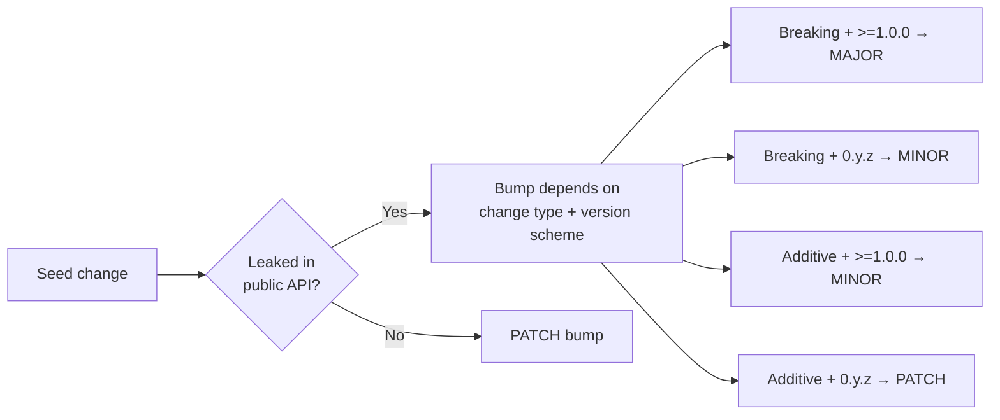

# 🌊 semwave

`semwave` is a static analysis tool that answers the question:

> "If I bump crates A, B and C in this Rust project - what else do I need to bump and how?"

It will help you to push changes faster and not break other people's code.

## Motivation

TODO

## How it works?

1. Accepts the list of breaking version bumps (the "seeds"). By default, this means `diff`-ing `Cargo.toml` files 
between two git refs, identifying crates whose dependency versions changed in breaking or
additive ways. You can also use `--direct` mode with comma-separated crates, which will tell `semwave`
directly which seeds to check against.

2. Walks the workspace dependency graph starting from the seeds. For each dependent,
it checks whether the crate leaks any seed types in its public API. If it does, that
crate itself needs a bump — and becomes a new seed, triggering the same check on *its*
dependents, and so on until the wave settles. The bump level (major/minor/patch) depends
on the change type and the consumer's version scheme (`0.y.z` vs `>=1.0.0`).

The result is three lists: MAJOR bumps, MINOR bumps, and PATCH bumps, plus optional
warnings when it had to guess conservatively.



## The good

- **Static analysis only** — no need to compile every dependent crate or run their test suites. The tool analyzes rustdoc JSON to detect leaked types, so results arrive in seconds, not hours.
- **Transitive propagation** — a bump in crate A that leaks into crate B automatically makes B a new seed. The wave keeps going until no new leaks are found, catching cascading effects that humans routinely miss.
- **Semver-scheme-aware** — correctly distinguishes `0.y.z` (where a minor bump is breaking) from `>=1.0.0` (where a minor bump is additive). Bump recommendations respect whichever scheme the consumer crate uses.
- **Under-bump detection** — if a crate already has a version bump in the diff but that bump is *insufficient* (e.g., PATCH when MINOR is required), `semwave` flags it explicitly.
- **Two input modes** — git-diff mode automatically discovers seeds from `Cargo.toml` changes between two refs; direct mode lets you ask hypothetical "what if?" questions without touching git.
- **Influence tree** — the `--tree` flag prints a human-readable tree showing exactly how and why each bump propagates, making it easy to explain the reasoning to reviewers.

## The bad

- **Requires a nightly toolchain** — rustdoc JSON output is a nightly-only feature. This can be a friction point in CI environments locked to stable.
- **Type-level only** — `semwave` detects leaked *types*, not behavioral changes. If a dependency silently changes the semantics of a function without altering its signature, the tool won't flag it.
- **Complex version requirements are unsupported** — ranges (`>=1.2, <2`), wildcards (`1.*`), and multi-constraint specs are skipped during seed detection.
- **Cargo workspaces only** — the tool is purpose-built for Rust/Cargo. It won't help with polyglot monorepos or non-Cargo Rust projects.
- **Rustdoc failures are handled conservatively** — if a crate fails to generate rustdoc JSON (e.g., due to missing system deps or feature flags), `semwave` assumes the worst-case bump and prints a warning, which can lead to over-bumping.

## Installation

```sh
git clone git@github.com:uandere/semwave.git
cd semwave
cargo install --path .
```

You'll also need a nightly toolchain installed, since rustdoc JSON output is a nightly-only feature:

```sh
rustup toolchain install nightly
```

## Usage

```
Determine semver bump requirements for workspace crates

Usage: semwave [OPTIONS]

Options:
      --source <SOURCE>  Source git ref to compare from (the base) [default: main]
      --target <TARGET>  Target git ref to compare to [default: HEAD]
      --direct <DIRECT>  Comma-separated crate names to treat as breaking-change seeds directly, skipping git-based version detection
      --no-color             Disable colored output
  -v, --verbose              Print which public API items cause each leak
  -t, --tree                 Print an influence tree showing how bumps propagate
      --rustdoc-stderr       Show cargo rustdoc stderr output (warnings, errors) during analysis
  -h, --help                 Print help
```

## Examples

### 1

**What happens if we introduce breaking changes to pin-project-lite in tokio repo?**

```
> semwave --direct pin-project-lite --tree
```

**Result:**

```
Direct mode: assuming BREAKING change for {"pin-project-lite"}

Analyzing tokio for public API exposure of ["pin-project-lite"]
Analyzing tokio-util for public API exposure of ["pin-project-lite"]
  -> tokio-util leaks pin-project-lite (Minor):
Analyzing tokio-stream for public API exposure of ["pin-project-lite"]
  -> tokio-stream leaks pin-project-lite (Minor):

=== Influence Tree ===
└── pin-project-lite (seed)
    ├── tokio  (PATCH)
    ├── tokio-stream  (MINOR)
    └── tokio-util  (MINOR)

=== Analysis Complete ===
MAJOR-bump list (Requires MAJOR bump / ↑.0.0): {}
MINOR-bump list (Requires MINOR bump / x.↑.0): {"tokio-stream", "tokio-util"}
PATCH-bump list (Requires PATCH bump / x.y.↑): {"tokio"}
```
