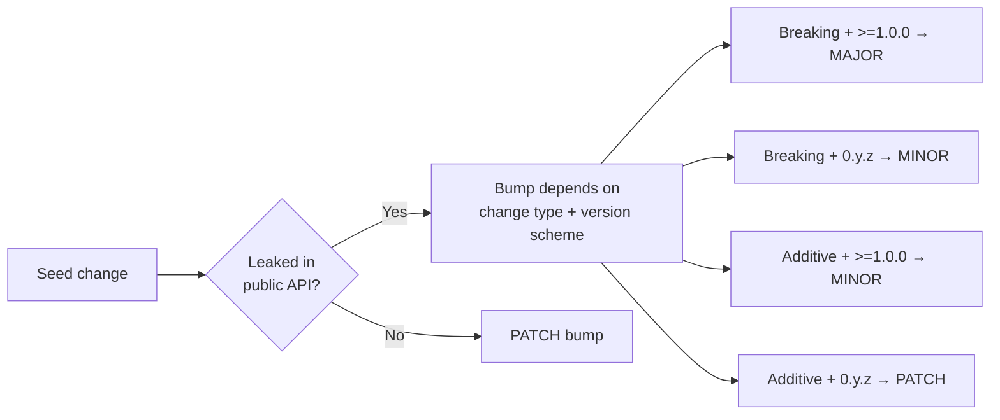

# 🌊 semwave

`semwave` is a static analysis tool that answers the question:

> "If I bump crates A, B and C in this Rust project - what else do I need to bump and how?"

It will help you to push changes faster and not break other people's code.

## Motivation

Many developers unintentionally violate semver rules in Rust projects they contribute to.
Large workspaces have deep dependency graphs, re-exports that hide where a type actually comes from, and version schemes that change the meaning of each bump level - all of which make it nearly impossible to manually determine what needs a version bump and how big. `semwave` automates that analysis so you don't have to.

## How it works?

1. Accepts the list of breaking version bumps (the "seeds"). By default, this means `diff`-ing `Cargo.toml` files 
between two git refs, identifying crates whose dependency versions changed in breaking or
additive ways. You can also use `--direct` mode with comma-separated crates, which will tell `semwave`
directly which seeds to check against.

2. Walks the workspace dependency graph starting from the seeds. For each dependent,
it checks whether the crate leaks any seed types in its public API. If it does, that
crate itself needs a bump - and becomes a new seed, triggering the same check on *its*
dependents, and so on until the wave settles. The bump level (major/minor/patch) depends
on the change type and the consumer's version scheme (`0.y.z` vs `>=1.0.0`).

The result is three lists: MAJOR bumps, MINOR bumps, and PATCH bumps, plus optional
warnings when it had to guess conservatively.



## Features

- **Static analysis only** - no need to compile every dependent crate or run their test suites. The tool analyzes rustdoc JSON to detect leaked types, so results arrive in seconds, not hours.
- **Transitive propagation** - a bump in crate A that leaks into crate B automatically makes B a new seed. The wave keeps going until no new leaks are found, catching cascading effects that humans routinely miss.
- **Semver-scheme-aware** - correctly distinguishes `0.y.z` (where a minor bump is breaking) from `>=1.0.0` (where a minor bump is additive). Bump recommendations respect whichever scheme the consumer crate uses.
- **Under-bump detection** - if a crate already has a version bump in the diff but that bump is *insufficient* (e.g., PATCH when MINOR is required), `semwave` flags it explicitly.
- **Two input modes** - git-diff mode automatically discovers seeds from `Cargo.toml` changes between two refs; direct mode lets you ask hypothetical "what if?" questions without touching git.
- **Influence tree** - the `--tree` flag prints a human-readable tree showing exactly how and why each bump propagates, making it easy to explain the reasoning to reviewers.

## Limitations

- **Requires a nightly toolchain** - rustdoc JSON output is a nightly-only feature. This can be a friction point in CI environments locked to stable.
- **Type-level only** - `semwave` detects leaked *types*, not behavioral changes. If a dependency silently changes the semantics of a function without altering its signature, the tool won't flag it.
- **Complex version requirements are unsupported** - ranges (`>=1.2, <2`), wildcards (`1.*`), and multi-constraint specs are skipped during seed detection.
- **Cargo projects only** - the tool is purpose-built for Rust/Cargo. It won't help with polyglot monorepos or non-Cargo Rust projects.
- **Rustdoc failures are handled conservatively** - if a crate fails to generate rustdoc JSON (e.g., due to nightly failing to build non-nightly code or missing compiler components), `semwave` assumes the worst-case bump and prints a warning, which can lead to over-bumping. This is a safe choice, as it prevents false negatives, but it also means that you need to do some manual work sometimes. 

## Installation

```sh
git clone git@github.com:uandere/semwave.git
cd semwave
cargo install --path .
```

You'll also need a nightly toolchain installed, since rustdoc JSON output is a nightly-only feature:

```sh
rustup toolchain install nightly
```

## Usage

```
Determine semver bump requirements for workspace crates

Usage: semwave [OPTIONS]

Options:
      --source <SOURCE>  Source git ref to compare from (the base) [default: main]
      --target <TARGET>  Target git ref to compare to [default: HEAD]
      --direct <DIRECT>  Comma-separated crate names to treat as breaking-change seeds directly, skipping git-based version detection
      --no-color             Disable colored output
  -v, --verbose              Print which public API items cause each leak
  -t, --tree                 Print an influence tree showing how bumps propagate
      --rustdoc-stderr       Show cargo rustdoc stderr output (warnings, errors) during analysis
  -h, --help                 Print help
```

## Examples

### 1

**What happens if we introduce breaking changes to `pin-project-lite` in `tokio` repo?**

```
> semwave --direct pin-project-lite --tree
```

**Result:**

```
Direct mode: assuming BREAKING change for {"pin-project-lite"}

Analyzing tokio for public API exposure of ["pin-project-lite"]
Analyzing tokio-util for public API exposure of ["pin-project-lite"]
  -> tokio-util leaks pin-project-lite (Minor):
Analyzing tokio-stream for public API exposure of ["pin-project-lite"]
  -> tokio-stream leaks pin-project-lite (Minor):

=== Influence Tree ===
└── pin-project-lite (seed)
    ├── tokio  (PATCH)
    ├── tokio-stream  (MINOR)
    └── tokio-util  (MINOR)

=== Analysis Complete ===
MAJOR-bump list (Requires MAJOR bump / ↑.0.0): {}
MINOR-bump list (Requires MINOR bump / x.↑.0): {"tokio-stream", "tokio-util"}
PATCH-bump list (Requires PATCH bump / x.y.↑): {"tokio"}
```

### 2

**What happens if we introduce breaking changes to `arrayvec` in `rust-analyzer` repo?**

```
> semwave --direct arrayvec
```

**Result:**

```                 
Direct mode: assuming BREAKING change for {"arrayvec"}

Analyzing tt for public API exposure of ["arrayvec"]
  -> tt leaks arrayvec (Minor):
Analyzing syntax-bridge for public API exposure of ["tt"]
  -> syntax-bridge leaks tt (Minor):
Analyzing proc-macro-api for public API exposure of ["tt"]
  -> proc-macro-api leaks tt (Minor):
Analyzing mbe for public API exposure of ["arrayvec", "syntax-bridge", "tt"]
  -> mbe leaks tt (Minor):
Analyzing cfg for public API exposure of ["tt"]
  -> cfg leaks tt (Minor):
Analyzing base-db for public API exposure of ["cfg"]
  -> base-db leaks cfg (Minor):
Analyzing project-model for public API exposure of ["base-db", "cfg"]
  -> project-model leaks base-db (Minor):
  -> project-model leaks cfg (Minor):
Analyzing proc-macro-srv-cli for public API exposure of ["proc-macro-api"]
  -> proc-macro-srv-cli leaks proc-macro-api (Minor):
Analyzing hir-expand for public API exposure of ["arrayvec", "base-db", "cfg", "mbe", "syntax-bridge", "tt"]
  -> hir-expand leaks arrayvec (Minor):
  -> hir-expand leaks base-db (Minor):
  -> hir-expand leaks cfg (Minor):
  -> hir-expand leaks mbe (Minor):
  -> hir-expand leaks syntax-bridge (Minor):
  -> hir-expand leaks tt (Minor):
Analyzing hir-def for public API exposure of ["arrayvec", "base-db", "cfg", "hir-expand", "syntax-bridge", "tt"]
  -> hir-def leaks base-db (Minor):
  -> hir-def leaks cfg (Minor):
  -> hir-def leaks hir-expand (Minor):
  -> hir-def leaks tt (Minor):
Analyzing test-fixture for public API exposure of ["base-db", "cfg", "hir-expand", "tt"]
  -> test-fixture leaks base-db (Minor):
  -> test-fixture leaks hir-expand (Minor):
Analyzing hir-ty for public API exposure of ["arrayvec", "base-db", "hir-def", "hir-expand"]
  -> hir-ty leaks base-db (Minor):
  -> hir-ty leaks hir-def (Minor):
  -> hir-ty leaks hir-expand (Minor):
Analyzing hir for public API exposure of ["arrayvec", "base-db", "cfg", "hir-def", "hir-expand", "hir-ty", "tt"]
  -> hir leaks arrayvec (Minor):
  -> hir leaks base-db (Minor):
  -> hir leaks cfg (Minor):
  -> hir leaks hir-def (Minor):
  -> hir leaks hir-expand (Minor):
  -> hir leaks hir-ty (Minor):
  -> hir leaks tt (Minor):
Analyzing ide-db for public API exposure of ["arrayvec", "base-db", "hir", "test-fixture"]
  -> ide-db leaks arrayvec (Minor):
  -> ide-db leaks base-db (Minor):
  -> ide-db leaks hir (Minor):
  -> ide-db leaks test-fixture (Minor):
Analyzing ide-completion for public API exposure of ["base-db", "hir", "ide-db"]
  -> ide-completion leaks ide-db (Minor):
Analyzing ide-assists for public API exposure of ["hir", "ide-db"]
  -> ide-assists leaks hir (Minor):
  -> ide-assists leaks ide-db (Minor):
Analyzing load-cargo for public API exposure of ["hir-expand", "ide-db", "proc-macro-api", "project-model", "tt"]
  -> load-cargo leaks hir-expand (Minor):
  -> load-cargo leaks ide-db (Minor):
  -> load-cargo leaks proc-macro-api (Minor):
  -> load-cargo leaks project-model (Minor):
Analyzing ide-ssr for public API exposure of ["hir", "ide-db"]
  -> ide-ssr leaks ide-db (Minor):
Analyzing ide-diagnostics for public API exposure of ["cfg", "hir", "ide-db"]
  -> ide-diagnostics leaks ide-db (Minor):
Analyzing ide for public API exposure of ["arrayvec", "cfg", "hir", "ide-assists", "ide-completion", "ide-db", "ide-diagnostics", "ide-ssr"]
  -> ide leaks arrayvec (Minor):
  -> ide leaks cfg (Minor):
  -> ide leaks hir (Minor):
  -> ide leaks ide-assists (Minor):
  -> ide leaks ide-completion (Minor):
  -> ide leaks ide-db (Minor):
  -> ide leaks ide-diagnostics (Minor):
  -> ide leaks ide-ssr (Minor):
Analyzing rust-analyzer for public API exposure of ["cfg", "hir", "hir-def", "hir-ty", "ide", "ide-completion", "ide-db", "ide-ssr", "load-cargo", "proc-macro-api", "project-model"]
  -> rust-analyzer leaks ide (Minor):
  -> rust-analyzer leaks ide-completion (Minor):
  -> rust-analyzer leaks ide-db (Minor):
  -> rust-analyzer leaks ide-ssr (Minor):
  -> rust-analyzer leaks project-model (Minor):
=== Analysis Complete ===
MAJOR-bump list (Requires MAJOR bump / ↑.0.0): {}
MINOR-bump list (Requires MINOR bump / x.↑.0): {"cfg", "syntax-bridge", "hir-expand", "tt", "hir-def", "project-model", "hir", "proc-macro-api", "load-cargo", "ide-assists", "ide-completion", "base-db", "mbe", "ide-diagnostics", "ide-ssr", "test-fixture", "hir-ty", "ide-db", "proc-macro-srv-cli", "ide", "rust-analyzer"}
PATCH-bump list (Requires PATCH bump / x.y.↑): {}
```
