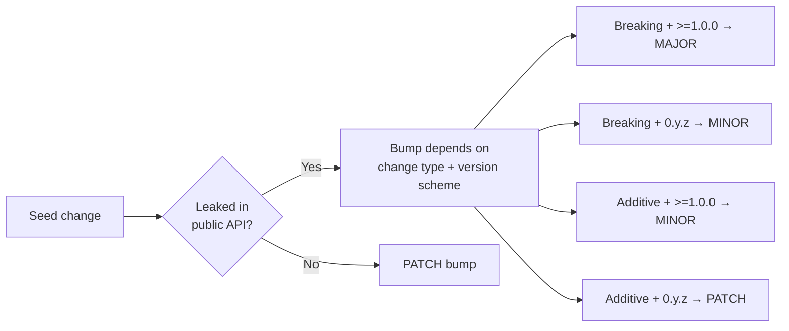

# 🌊 semwave

`semwave` is a static analysis tool that answers the question:

> "If I bump crates A, B and C in this Rust project - what else do I need to bump and how?"

It will help you to ensure that changes in multi-repo Rust workspaces don't violate SemVer rules.  

## Current State

⚠️ This project is under active development, and may change its behavior drastically over time. ⚠️

Feel free to contribute, ask questions and propose new features.

## Motivation

Many developers unintentionally violate SemVer rules in Rust workspaces by **incorrectly bumping the dependents of the crates they bumped** (or not bumping them at all). This causes issues with publishing - as `cargo publish` requires all dependencies to be resolved to specific, valid versions, and failing to propagate bumps can lead to "Type Mismatch: expected type X, found type X" errors for downstream users.

Identifying manually whether a crate depends in a breaking or a non-breaking way on some other crate has long been recognized as a stupidly hard task. This is because the definitions in a dependency have so many ways to "sneak" into the dependent's public API:
- Complex generics with lots of boundaries
- Re-exports, especially under different names
- Deeply nested structs with public fields
- `impl Trait` in return positions
- Trait implementations on foreign types & blanket implementations
- Type aliases (e.g. `pub type Client = other_crate::Client`)

...and many more!

As if that wasn't enough, you need to perform those checks on **every single crate that got any of its dependency version updated** in the workspace. Large workspaces have deep dependency graphs, re-exports that hide where a type actually comes from, and version schemes that change the meaning of each bump level. All that makes it nearly *impossible* to manually determine what needs a version bump and how big. `semwave` automates that analysis so you don't have to.

## How Does It Work?

1. Accepts the list of breaking version bumps (the "seeds"). By default, this means `diff`-ing `Cargo.toml` files 
between two git refs, identifying crates whose dependency versions changed in breaking or
additive ways. You can also use `--direct` mode with comma-separated crates, which will tell `semwave` to 
"suppose" that the given crates were bumped in a breaking manner.

2. Walks the workspace dependency graph starting from the seeds. For each dependent,
it checks whether the crate leaks any seed types in its public API. If it does, that
crate itself needs a bump - and becomes a new seed, triggering the same check on *its*
dependents, and so on until the wave settles. The bump level (major/minor/patch) depends
on the change type and the consumer's version scheme (`0.y.z` vs `>=1.0.0`).

The result is three lists: MAJOR bumps, MINOR bumps, and PATCH bumps, plus optional
warnings when it had to guess conservatively.



## Features

- **Skips redundant analysis** - the tool only analyzes the crates that are potentially affected. Also, if a crate is already at the maximum bump level (breaking), it won't be reanalyzed when a dependency triggers another wave iteration. In large workspaces with many inter-dependent seeds this avoids dozens of unnecessary `cargo rustdoc` invocations. (Disabled when `--tree` is passed, so the influence tree stays complete.)
- **Transitive propagation** - a bump in crate A that leaks into crate B automatically makes B a new seed. The wave keeps going until no new leaks are found, catching cascading effects that humans routinely miss.
- **Semver-scheme-aware** - correctly distinguishes `0.y.z` (where a minor bump is breaking) from `>=1.0.0` (where a minor bump is additive). Bump recommendations respect whichever scheme the consumer crate uses.
- **Under-bump detection** - if a crate already has a version bump in the diff but that bump is *insufficient* (e.g., PATCH when MINOR is required), `semwave` flags it explicitly.
- **Two input modes** - git-diff mode automatically discovers seeds from `Cargo.toml` changes between two refs; direct mode lets you ask hypothetical "what if?" questions without touching git.
- **Verbose Mode & Influence tree** - the `--verbose` flag shows exact definitions being leaked, while the `--tree` flag prints a human-readable tree showing exactly how and why each bump propagates, making it easy to explain the reasoning to reviewers.

## Limitations

- **Requires a nightly toolchain** - rustdoc JSON output is a nightly-only feature.
- **Type-level only** - `semwave` detects leaked *definitions*, not behavioral changes. If a dependency silently changes the semantics of a function without altering its signature, the tool won't flag it.
- **Complex version requirements are unsupported** - ranges (`>=1.2, <2`), wildcards (`1.*`), and multi-constraint specs are skipped during seed detection.
- **Cargo projects only** - the tool is purpose-built for Rust/Cargo. It won't help with polyglot monorepos or non-Cargo Rust projects.
- **Rustdoc failures are handled conservatively** - if a crate fails to generate rustdoc JSON (e.g., due to nightly failing to build non-nightly code or missing features), `semwave` assumes the worst-case bump and prints a warning, which can lead to over-bumping. This is a safe choice, as it prevents false negatives, but it also means that you need to do some manual work sometimes. 

## Installation

```sh
git clone git@github.com:uandere/semwave.git
cd semwave
cargo install --path .
```

You'll also need a nightly toolchain installed, since rustdoc JSON output is a nightly-only feature:

```sh
rustup toolchain install nightly
```

## Usage

```
Determine semver bump requirements for workspace crates.

Usage: semwave [OPTIONS]

Options:
      --source <SOURCE>        Source git ref to compare from (the base) [default: main]
      --target <TARGET>        Target git ref to compare to [default: HEAD]
      --direct <DIRECT>        Comma-separated crate names to treat as breaking-change seeds directly, skipping git-based version detection
      --no-color               Disable colored output
  -v, --verbose                Print which public API items cause each leak
  -t, --tree                   Print an influence tree showing how bumps propagate
      --rustdoc-stderr         Show cargo rustdoc stderr output (warnings, errors) during analysis
      --toolchain <TOOLCHAIN>  Rust toolchain to use for rustdoc JSON generation (e.g. "nightly-2025-01-15") [default: nightly]
      --include-binaries       Include binary-only crates in the analysis (skipped by default)
  -h, --help                   Print help
```

> **Note:** By default, `semwave` skips re-analyzing crates that are already at the maximum bump level (breaking), which can dramatically speed up runs in large workspaces with many inter-dependent seeds. Passing `--tree` disables this optimization so the full influence tree can be built, which may result in noticeably longer analysis times.

## FAQ

### Why not just use `cargo-semver-checks` / `release-plz`?

Those tools answer a different question. `cargo-semver-checks` tells you whether a **single crate's** public API changed in a breaking way. `release-plz` automates the release workflow for **individual crates**. Neither of them propagates bumps: if crate A gets a breaking change and crate B re-exports a type from A, those tools won't tell you that B also needs a bump. `semwave` exists specifically for that transitive propagation problem.

### Does `semwave` detect breaking API changes itself?

No. It takes a set of already-known version changes (either from a git diff or from `--direct` mode) and figures out what *else* needs to bump as a consequence. It does not compare two versions of a crate's API to decide whether the change is breaking. Pair it with `cargo-semver-checks` for full coverage: let `cargo-semver-checks` find the initial breaking changes, then let `semwave` propagate them.

### What version changes does `semwave` detect?

Both internal workspace crate bumps and external dependency version changes are detected and used as seeds for the analysis.

### Why does it need a nightly toolchain?

`semwave` analyzes rustdoc JSON, which is an unstable nightly-only output format. The nightly toolchain is only used to generate those JSON files - your actual project does not need to compile on nightly, and `semwave` never runs your tests or builds your binaries.

> Note: if you're getting errors while building `rustdoc` JSON, it may be a good idea to try different
> (perhaps, older) versions of nightly by passing `--toolchain <nightly-version>`.

### What does "leaks" mean exactly?

A crate "leaks" a dependency when a type from that dependency appears in the crate's public API - in a public function signature, a public struct field, a re-export, a trait bound, an associated type, etc. If consumers of your crate can observe the dependency's types through your API, a breaking change in that dependency is also a breaking change in yours.

### Does `semvawe` has fasle positives / negatives?

It shouldn't, in theory. If it does and you can prove it - this is a bug. Please, report it via GitHub issues.

### What happens when `rustdoc` fails for a crate?

`semwave` assumes the worst case: it treats the crate as if it leaks all affected dependencies at their highest bump level, and prints a warning. This is conservative by design - it may lead to over-bumping, but it prevents you from accidentally under-bumping. You can pass `--rustdoc-stderr` to see the actual rustdoc errors and fix them.

### Can I use this in CI?

Yes, but only experimentally (because of potential over-bumping propagation and inability to skip singular crates). Run `semwave --source origin/main --target HEAD --no-color` in your CI pipeline. The tool exits with code `1` when it finds crates that are missing a version bump or have an insufficient one, so your CI job will fail automatically. Crates where rustdoc generation failed are reported as warnings but do not cause a non-zero exit on their own - only confirmed missing or insufficient bumps do.

### Does it handle workspace version inheritance?

Yes. When a crate uses `version.workspace = true`, `semwave` resolves the actual version from the workspace root manifest at each git ref. Both the seed detection (git-diff mode) and the bump-level calculation take inherited versions into account.

## Examples

### 1

**What happens if we introduce breaking changes to `pin-project-lite` in `tokio` repo?**

```
> RUSTFLAGS="--cfg tokio_unstable" RUSTDOCFLAGS="--cfg tokio_unstable" \
    semwave --direct pin-project-lite --tree
```

**Result** (at tokio commit [`8c980ea`](https://github.com/tokio-rs/tokio/commit/8c980ea75a0f8dd2799403777db700c2e8f4cda4)):

```
Direct mode: assuming BREAKING change for {"pin-project-lite"}

Analyzing tokio for public API exposure of ["pin-project-lite"]
  -> tokio leaks pin-project-lite (Major):
Analyzing tests-build for public API exposure of ["tokio"]
  -> tests-build leaks tokio (Minor):
Analyzing tokio-util for public API exposure of ["pin-project-lite", "tokio"]
  -> tokio-util leaks pin-project-lite (Minor):
  -> tokio-util leaks tokio (Minor):
Analyzing tokio-test for public API exposure of ["tokio"]
  -> tokio-test leaks tokio (Minor):
Analyzing tokio-stream for public API exposure of ["pin-project-lite", "tokio", "tokio-util"]
  -> tokio-stream leaks pin-project-lite (Minor):
  -> tokio-stream leaks tokio (Minor):
Analyzing tests-integration for public API exposure of ["tokio", "tokio-test"]

=== Influence Tree ===
└── pin-project-lite (seed)
    ├── tokio  (MAJOR)
    │   ├── tests-build  (MINOR)
    │   ├── tests-integration  (PATCH)
    │   ├── tokio-stream  (MINOR)
    │   ├── tokio-test  (MINOR)
    │   │   └── tests-integration (PATCH, already shown above)
    │   └── tokio-util  (MINOR)
    │       └── tokio-stream (PATCH, already shown above)
    ├── tokio-stream (MINOR, already shown above)
    └── tokio-util (MINOR, already shown above)

=== Analysis Complete ===
MAJOR-bump list (Requires MAJOR bump / ↑.0.0): {"tokio"}
MINOR-bump list (Requires MINOR bump / x.↑.0): {"tests-build", "tokio-stream", "tokio-test", "tokio-util"}
PATCH-bump list (Requires PATCH bump / x.y.↑): {"tests-integration"}
```

> **Note:** tokio uses a custom `--cfg tokio_unstable` flag that gates parts of its API.
> Passing `RUSTFLAGS` and `RUSTDOCFLAGS` ensures rustdoc can compile the full API surface.
> Without these flags, `semwave` still works but conservatively assumes a MAJOR bump for
> tokio and prints a warning.

### 2

**What happens if we introduce breaking changes to `arrayvec` AND `itertools` in `rust-analyzer` repo?**

```
> semwave --direct arrayvec,itertools
```

**Result:**

```                                                 
Direct mode: assuming BREAKING change for {"arrayvec", "itertools"}

Analyzing stdx for public API exposure of ["itertools"]
  -> stdx leaks itertools (Minor):
Analyzing vfs for public API exposure of ["stdx"]
  -> vfs leaks stdx (Minor):
Analyzing test-utils for public API exposure of ["stdx"]
  -> test-utils leaks stdx (Minor):
Analyzing vfs-notify for public API exposure of ["stdx", "vfs"]
  -> vfs-notify leaks stdx (Minor):
  -> vfs-notify leaks vfs (Minor):
Analyzing syntax for public API exposure of ["itertools", "stdx"]
  -> syntax leaks itertools (Minor):
  -> syntax leaks stdx (Minor):
Analyzing span for public API exposure of ["stdx", "syntax", "vfs"]
  -> span leaks stdx (Minor):
  -> span leaks syntax (Minor):
  -> span leaks vfs (Minor):
Analyzing proc-macro-srv for public API exposure of ["span"]
  -> proc-macro-srv leaks span (Minor):
Analyzing tt for public API exposure of ["arrayvec", "span", "stdx"]
  -> tt leaks arrayvec (Minor):
  -> tt leaks span (Minor):
  -> tt leaks stdx (Minor):
Analyzing syntax-bridge for public API exposure of ["span", "stdx", "syntax", "tt"]
  -> syntax-bridge leaks span (Minor):
  -> syntax-bridge leaks stdx (Minor):
  -> syntax-bridge leaks syntax (Minor):
  -> syntax-bridge leaks tt (Minor):
Analyzing proc-macro-api for public API exposure of ["proc-macro-srv", "span", "stdx", "tt"]
  -> proc-macro-api leaks proc-macro-srv (Minor):
  -> proc-macro-api leaks span (Minor):
  -> proc-macro-api leaks stdx (Minor):
  -> proc-macro-api leaks tt (Minor):
Analyzing mbe for public API exposure of ["arrayvec", "span", "stdx", "syntax-bridge", "tt"]
  -> mbe leaks span (Minor):
  -> mbe leaks stdx (Minor):
  -> mbe leaks tt (Minor):
Analyzing cfg for public API exposure of ["span", "syntax", "tt"]
  -> cfg leaks syntax (Minor):
  -> cfg leaks tt (Minor):
Analyzing base-db for public API exposure of ["cfg", "span", "syntax", "vfs"]
  -> base-db leaks cfg (Minor):
  -> base-db leaks span (Minor):
  -> base-db leaks syntax (Minor):
  -> base-db leaks vfs (Minor):
Analyzing project-model for public API exposure of ["base-db", "cfg", "itertools", "span", "stdx"]
  -> project-model leaks base-db (Minor):
  -> project-model leaks cfg (Minor):
  -> project-model leaks stdx (Minor):
Analyzing proc-macro-srv-cli for public API exposure of ["proc-macro-api", "proc-macro-srv"]
  -> proc-macro-srv-cli leaks proc-macro-api (Minor):
Analyzing hir-expand for public API exposure of ["arrayvec", "base-db", "cfg", "itertools", "mbe", "span", "stdx", "syntax", "syntax-bridge", "tt"]
  -> hir-expand leaks arrayvec (Minor):
  -> hir-expand leaks base-db (Minor):
  -> hir-expand leaks cfg (Minor):
  -> hir-expand leaks mbe (Minor):
  -> hir-expand leaks span (Minor):
  -> hir-expand leaks stdx (Minor):
  -> hir-expand leaks syntax (Minor):
  -> hir-expand leaks syntax-bridge (Minor):
  -> hir-expand leaks tt (Minor):
Analyzing hir-def for public API exposure of ["arrayvec", "base-db", "cfg", "hir-expand", "itertools", "span", "stdx", "syntax", "syntax-bridge", "tt"]
  -> hir-def leaks base-db (Minor):
  -> hir-def leaks cfg (Minor):
  -> hir-def leaks hir-expand (Minor):
  -> hir-def leaks span (Minor):
  -> hir-def leaks stdx (Minor):
  -> hir-def leaks syntax (Minor):
  -> hir-def leaks tt (Minor):
Analyzing test-fixture for public API exposure of ["base-db", "cfg", "hir-expand", "span", "stdx", "test-utils", "tt"]
  -> test-fixture leaks base-db (Minor):
  -> test-fixture leaks hir-expand (Minor):
  -> test-fixture leaks span (Minor):
  -> test-fixture leaks stdx (Minor):
  -> test-fixture leaks test-utils (Minor):
Analyzing hir-ty for public API exposure of ["arrayvec", "base-db", "hir-def", "hir-expand", "itertools", "span", "stdx", "syntax"]
  -> hir-ty leaks base-db (Minor):
  -> hir-ty leaks hir-def (Minor):
  -> hir-ty leaks hir-expand (Minor):
  -> hir-ty leaks stdx (Minor):
  -> hir-ty leaks syntax (Minor):
Analyzing hir for public API exposure of ["arrayvec", "base-db", "cfg", "hir-def", "hir-expand", "hir-ty", "itertools", "span", "stdx", "syntax", "tt"]
  -> hir leaks arrayvec (Minor):
  -> hir leaks base-db (Minor):
  -> hir leaks cfg (Minor):
  -> hir leaks hir-def (Minor):
  -> hir leaks hir-expand (Minor):
  -> hir leaks hir-ty (Minor):
  -> hir leaks span (Minor):
  -> hir leaks stdx (Minor):
  -> hir leaks syntax (Minor):
  -> hir leaks tt (Minor):
Analyzing ide-db for public API exposure of ["arrayvec", "base-db", "hir", "itertools", "span", "stdx", "syntax", "test-fixture", "test-utils", "vfs"]
  -> ide-db leaks arrayvec (Minor):
  -> ide-db leaks base-db (Minor):
  -> ide-db leaks hir (Minor):
  -> ide-db leaks span (Minor):
  -> ide-db leaks stdx (Minor):
  -> ide-db leaks syntax (Minor):
  -> ide-db leaks test-fixture (Minor):
  -> ide-db leaks vfs (Minor):
Analyzing ide-completion for public API exposure of ["base-db", "hir", "ide-db", "itertools", "stdx", "syntax"]
  -> ide-completion leaks ide-db (Minor):
  -> ide-completion leaks stdx (Minor):
Analyzing ide-assists for public API exposure of ["hir", "ide-db", "itertools", "stdx", "syntax"]
  -> ide-assists leaks hir (Minor):
  -> ide-assists leaks ide-db (Minor):
  -> ide-assists leaks stdx (Minor):
  -> ide-assists leaks syntax (Minor):
Analyzing load-cargo for public API exposure of ["hir-expand", "ide-db", "itertools", "proc-macro-api", "project-model", "span", "tt", "vfs", "vfs-notify"]
  -> load-cargo leaks hir-expand (Minor):
  -> load-cargo leaks ide-db (Minor):
  -> load-cargo leaks proc-macro-api (Minor):
  -> load-cargo leaks project-model (Minor):
  -> load-cargo leaks vfs (Minor):
Analyzing ide-ssr for public API exposure of ["hir", "ide-db", "itertools", "syntax"]
  -> ide-ssr leaks ide-db (Minor):
Analyzing ide-diagnostics for public API exposure of ["cfg", "hir", "ide-db", "itertools", "stdx", "syntax"]
  -> ide-diagnostics leaks ide-db (Minor):
  -> ide-diagnostics leaks stdx (Minor):
  -> ide-diagnostics leaks syntax (Minor):
Analyzing ide for public API exposure of ["arrayvec", "cfg", "hir", "ide-assists", "ide-completion", "ide-db", "ide-diagnostics", "ide-ssr", "itertools", "span", "stdx", "syntax"]
  -> ide leaks arrayvec (Minor):
  -> ide leaks cfg (Minor):
  -> ide leaks hir (Minor):
  -> ide leaks ide-assists (Minor):
  -> ide leaks ide-completion (Minor):
  -> ide leaks ide-db (Minor):
  -> ide leaks ide-diagnostics (Minor):
  -> ide leaks ide-ssr (Minor):
  -> ide leaks stdx (Minor):
  -> ide leaks syntax (Minor):
Analyzing rust-analyzer for public API exposure of ["cfg", "hir", "hir-def", "hir-ty", "ide", "ide-completion", "ide-db", "ide-ssr", "itertools", "load-cargo", "proc-macro-api", "project-model", "stdx", "syntax", "vfs", "vfs-notify"]
  -> rust-analyzer leaks ide (Minor):
  -> rust-analyzer leaks ide-completion (Minor):
  -> rust-analyzer leaks ide-db (Minor):
  -> rust-analyzer leaks ide-ssr (Minor):
  -> rust-analyzer leaks project-model (Minor):
  -> rust-analyzer leaks stdx (Minor):
  -> rust-analyzer leaks vfs (Minor):
=== Analysis Complete ===
MAJOR-bump list (Requires MAJOR bump / ↑.0.0): {}
MINOR-bump list (Requires MINOR bump / x.↑.0): {"base-db", "cfg", "hir", "hir-def", "hir-expand", "hir-ty", "ide", "ide-assists", "ide-completion", "ide-db", "ide-diagnostics", "ide-ssr", "load-cargo", "mbe", "proc-macro-api", "proc-macro-srv", "proc-macro-srv-cli", "project-model", "rust-analyzer", "span", "stdx", "syntax", "syntax-bridge", "test-fixture", "test-utils", "tt", "vfs", "vfs-notify"}
PATCH-bump list (Requires PATCH bump / x.y.↑): {}
```
