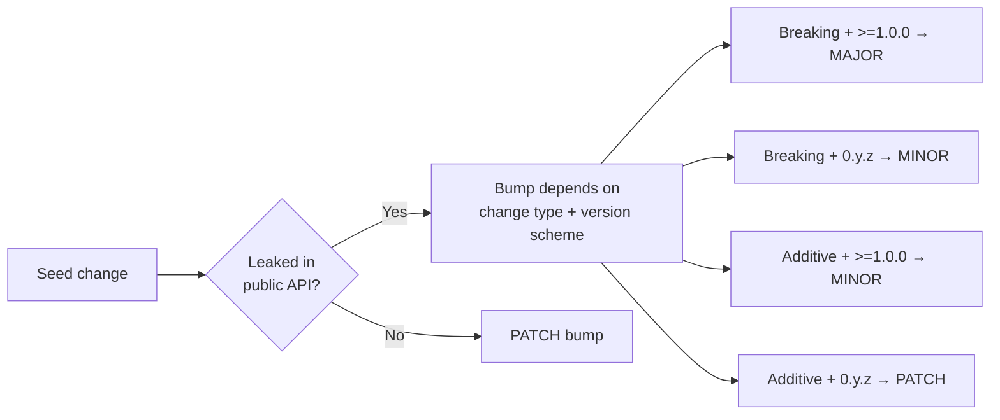

# 🌊 semwave

`semwave` is a static analysis tool that answers the question:

> "If I bump crates A, B and C in this Rust project - what else do I need to bump and how?"

It will help you to push changes faster and not break other people's code.

## Motivation

TODO

## How it works?

1. Accepts the list of breaking version bumps (the "seeds"). By default, this means `diff`-ing `Cargo.toml` files 
between two git refs, identifying crates whose dependency versions changed in breaking or
additive ways. You can also use `--direct` mode with comma-separated crates, which will tell `semwave`
directly which seeds to check against.

2. Walks the workspace dependency graph starting from the seeds. For each dependent,
it checks whether the crate leaks any seed types in its public API. If it does, that
crate itself needs a bump — and becomes a new seed, triggering the same check on *its*
dependents, and so on until the wave settles. The bump level (major/minor/patch) depends
on the change type and the consumer's version scheme (`0.y.z` vs `>=1.0.0`).

The result is three lists: MAJOR bumps, MINOR bumps, and PATCH bumps, plus optional
warnings when it had to guess conservatively.



## The good

TODO

## The bad

TODO

## Installation

```sh
git clone git@github.com:uandere/semwave.git
cd semwave
cargo install --path .
```

You'll also need a nightly toolchain installed, since `cargo public-api` depends on it:

```sh
rustup toolchain install nightly
cargo +nightly install cargo-public-api
```

## Usage

```
Determine semver bump requirements for workspace crates

Usage: semwave [OPTIONS]

Options:
      --source <SOURCE>  Source git ref to compare from (the base) [default: main]
      --target <TARGET>  Target git ref to compare to [default: HEAD]
      --direct <DIRECT>  Comma-separated crate names to treat as breaking-change seeds directly, skipping git-based version detection
      --no-color         Disable colored output
  -v, --verbose          Print the public API lines that cause leaks
  -t, --tree             Print an influence tree showing how bumps propagate
  -h, --help             Print help
```

## Examples

### 1

**What happens if we introduce breaking changes to pin-project-lite in tokio repo?**

```
> semwave --direct pin-project-lite --tree
```

**Result:**

```
Direct mode: assuming BREAKING change for {"pin-project-lite"}

Analyzing tokio for public API exposure of ["pin-project-lite"]
Analyzing tokio-util for public API exposure of ["pin-project-lite"]
  -> tokio-util leaks pin-project-lite (Minor):
Analyzing tokio-stream for public API exposure of ["pin-project-lite"]
  -> tokio-stream leaks pin-project-lite (Minor):

=== Influence Tree ===
└── pin-project-lite (seed)
    ├── tokio  (PATCH)
    ├── tokio-stream  (MINOR)
    └── tokio-util  (MINOR)

=== Analysis Complete ===
MAJOR-bump list (Requires MAJOR bump / ↑.0.0): {}
MINOR-bump list (Requires MINOR bump / x.↑.0): {"tokio-stream", "tokio-util"}
PATCH-bump list (Requires PATCH bump / x.y.↑): {"tokio"}
```
